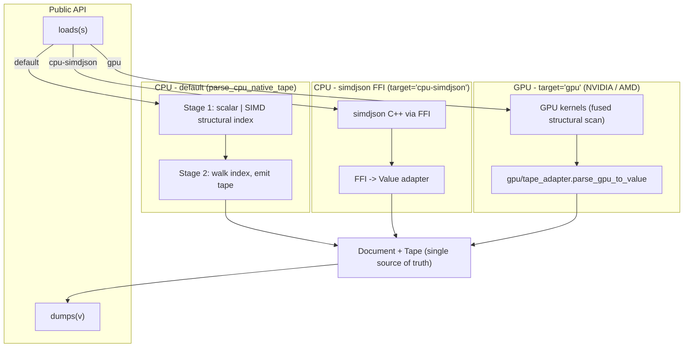
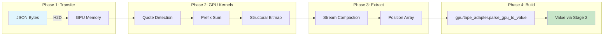

# Architecture

In v0.2 the library is built around a single in-memory representation:
a tape-backed `Document` plus a lightweight `Value` view. Every CPU and
GPU pipeline funnels into the same shape, so the rest of the library
(LazyValue, JSONPath, JSON Patch, schema validation, reflection serde)
operates on one model.

## System Overview



`target='gpu'` runs natively on NVIDIA, AMD, and Apple Metal. The
Apple Metal path emits the raw `{}[]:,` bitmap from
`fused_json_kernel` and lets `gpu/tape_adapter.mojo` apply the
in-string filter on the CPU side, which sidesteps the cross-chunk
escape edge cases that the GPU-side mask would otherwise miss. Apple
Metal also runs a lean variant that drops the popcount and
hierarchical prefix-sum stages and the CPU bracket-match pass,
because the v0.2 tape adapter does not consume `pair_pos`.

## CPU Backends

### Pure Mojo Backend (Default) -- v0.2 two-pass parser

**Implementation:** Stage 1 builds a structural index of every byte
offset whose character is `{ } [ ] : , "` (outside string literals).
Stage 2 walks that index to produce a `Value` tree without re-scanning
bytes for structure.

**Location:**
- `json/cpu/stage1_scalar.mojo` -- byte-by-byte oracle (canonical;
  used for correctness validation of the SIMD path).
- `json/cpu/stage1.mojo` -- 32-byte SIMD scan via
  `memory.unsafe.pack_bits`.
- `json/cpu/stage2.mojo` -- index walker; emits `Value`. Strict
  validation for trailing commas, double commas, leading zeros,
  missing colons, missing values, unquoted keys, invalid escapes,
  and trailing top-level content.
- `json/cpu/__init__.parse_cpu_native_tape[force_scalar=False|True]`
  -- the public CPU entry point; emits a tape-backed `Value` view.
  Default is SIMD (~1.2x faster than the scalar walker on the
  benchmark corpora); pass `force_scalar=True` for differential
  testing against the scalar oracle.
- `tests/test_stage1_equivalence.mojo` -- asserts stage 1 SIMD and
  scalar produce byte-identical position lists, including a
  full-document run against the benchmark corpora.

**Performance (Apple Silicon, M-series; `pixi run -e dev bench-cpu`):**

Both benches use the same protocol: 3 warmup + 100 measured
iterations, min-time-derived throughput. The bench reports two
workloads per parser:

* `parse_only`: `loads(...)` + peek the root tag.
* `parse_traverse`: parse + recursively visit every leaf via
  the public `Value` API.

| Corpus | Size | simdjson `parse_only` | mojo `parse_only` | simdjson `parse_traverse` | mojo `parse_traverse` |
|---|---|---|---|---|---|
| `twitter.json` | 616 KB | 0.235 ms / 2.68 GB/s | 0.54 ms / 1.17 GB/s | 0.236 ms / 2.67 GB/s | 1.12 ms / 0.57 GB/s |
| `citm_catalog.json` | 1.7 MB | 0.440 ms / 3.92 GB/s | 1.09 ms / 1.58 GB/s | 0.528 ms / 3.27 GB/s | 2.49 ms / 0.69 GB/s |

`parse_traverse` only adds a small constant on top of `parse_only`
on the Mojo side because every `Value` is a stable tape index, so
iteration is a tape walk and not a re-parse. The remaining 2.3-2.5x
to native simdjson on `parse_only` is algorithmic (no Eisel-Lemire
float fast path, recursive emission rather than a flat tape walker,
no AVX-512 64-byte chunks). Full breakdown in
[performance.md](./performance.md).

**Usage:**
```mojo
from json import loads
var data = loads('{"key": "value"}')  # default
```

### simdjson FFI Backend

**Implementation:** FFI wrapper around [simdjson](https://github.com/simdjson/simdjson)

**Location:**
- `json/cpu/simdjson_ffi/` -- C++ wrapper
- `json/cpu/simdjson_ffi.mojo` -- Mojo FFI bindings

**Performance:** ~0.48 GB/s on `twitter.json` -- the FFI marshalling is
the bottleneck here; if you want the simdjson algorithm without the
FFI tax, use the default Mojo simd path instead.

**Usage:**
```mojo
from json import loads
var data = loads[target="cpu-simdjson"]('{"key": "value"}')
```

### CPU Parsing Flow (simdjson)

1. Load JSON string into memory.
2. Call simdjson via FFI (`json/cpu/simdjson_ffi.mojo`).
3. Recursively build `Value` tree from the simdjson result.
4. Return parsed `Value`.

### CPU Parsing Flow (default, two-pass)

1. **Stage 1:** scan bytes once, emitting offsets of structural
   characters outside strings.
2. **Stage 2:** walk the structural index in O(structural_count),
   recursively constructing `Value` for objects, arrays, strings,
   numbers, and primitives. No byte-level re-scan.
3. Return parsed `Value`.

## GPU Backend

**Implementation:** Native Mojo GPU kernels inspired by [cuJSON](https://github.com/AutomataLab/cuJSON)

**Location:**
- `json/gpu/parser.mojo` - Main GPU parser (`parse_json_gpu`, `parse_json_gpu_from_pinned`)
- `json/gpu/kernels.mojo` - CUDA-style GPU kernels (fused bitmap + structural extraction)
- `json/gpu/stream_compact.mojo` - GPU stream compaction for position extraction
- `json/gpu/bracket_match.mojo` - GPU parallel bracket matching (experimental; the main parse path uses a CPU stack matcher after stream compaction)

**Performance (804 MB `twitter_large_record.json`):**

| Platform | Throughput | vs cuJSON | Pipeline |
|---|---:|---|---|
| AMD MI355X | 13 GB/s | 3.6x | single-shot |
| NVIDIA B200 | 8 GB/s | 1.8x | single-shot |
| Apple M3 Pro | 3.1 GB/s | n/a | lean Metal |

**Techniques:**
- Bitmap-based parsing
- Parallel prefix sums
- GPU stream compaction for position extraction
- Hybrid GPU/CPU pipeline (Apple Metal: in-string filter on CPU)

### GPU Pipeline



### GPU Parsing Flow

1. **Host-to-Device Transfer:** Copy JSON bytes to GPU using pinned memory (HostBuffer) for fast transfer (~15ms for 804MB)
2. **GPU Kernels:** Execute parallel kernels to:
   - Create bitmaps for quotes, escapes, structural characters
   - Compute parallel prefix sums to identify in-string regions
   - Extract structural character bitmap
3. **Stream Compaction (GPU):** Extract only the positions of structural characters (~50ms)
4. **Device-to-Host Transfer:** Copy compact position array back to CPU
5. **Tape Adapter (CPU):** `gpu/tape_adapter.parse_gpu_to_value` merges the GPU `{ } [ ] : ,` positions with a small CPU quote-only scan to produce a stage1-compatible `StructuralIndex`, then runs **stage 2** to write tape entries into a `Document`.
6. **Value:** Returned as a tape-backed view (`Value(doc, tape_idx=0)`) over that `Document`; no extra DOM construction step.

### Why Hybrid GPU/CPU?

- **GPU excels at:** Parallel bitmap operations, prefix sums, stream compaction
- **CPU excels at:** Sequential bracket matching, tree construction with dynamic memory
- **Key insight:** GPU stream compaction dramatically reduces D2H transfer size (from 465MB to <10MB for 804MB input)

## Value Type

The `Value` struct represents any JSON value (null, bool, int, float, string, array, object).

See [API Reference](https://ehsanmok.github.io/json/) for complete `Value` methods.

## Directory Structure

```
json/
├── __init__.mojo              # Public API exports
├── prelude.mojo               # `from json.prelude import *` shortcut
├── parser.mojo                # Unified CPU/GPU dispatch, loads / load
├── serialize.mojo             # dumps / dump
├── document.mojo              # Tape-backed Document (single source of truth)
├── value/
│   ├── __init__.mojo         # Re-exports
│   ├── value.mojo            # Tape-backed Value view
│   ├── owned.mojo            # OwnedValue + _value_to_owned bridge
│   └── raw_ops.mojo          # String ops shared with LazyValue
├── types.mojo                 # JSONInput, JSONResult
├── iterator.mojo              # JSONIterator
├── ndjson.mojo                # NDJSON parsing / serialization
├── lazy.mojo                  # LazyValue (on-demand parsing of substrings)
├── streaming.mojo             # Streaming parser for huge files
├── config.mojo                # Parser / serializer configuration
├── errors.mojo                # Error formatting with line / column
├── unicode.mojo               # Unicode escape handling
├── patch.mojo                 # JSON Patch & Merge Patch (RFC 6902 / 7396)
├── jsonpath.mojo              # JSONPath (RFC 9535)
├── schema.mojo                # JSON Schema validation
├── reflection.mojo            # Compile-time reflection serde
├── deserialize.mojo           # serialize_json / deserialize_json
├── cpu/
│   ├── __init__.mojo         # CPU dispatch entry points
│   ├── types.mojo            # Common JSON type constants
│   ├── stage1_scalar.mojo    # Byte-by-byte structural index oracle
│   ├── stage1.mojo           # SIMD structural index (pack_bits)
│   ├── stage2.mojo           # Index walker -> Document tape
│   ├── simdjson_ffi.mojo     # simdjson FFI bindings (target='cpu-simdjson')
│   └── simdjson_ffi/         # C++ simdjson wrapper (libsimdjson via conda)
└── gpu/
    ├── parser.mojo            # GPU parser entry points
    ├── kernels.mojo           # Fused structural-scan kernels
    ├── stream_compact.mojo    # GPU stream compaction
    ├── bracket_match.mojo     # GPU parallel bracket match (experimental)
    └── tape_adapter.mojo      # GPU positions -> stage 2 -> Document

tests/
├── test_api.mojo                   # Unified API (loads / dumps / load / dump)
├── test_value.mojo                 # Tape-backed Value semantics
├── test_value_mutation.mojo        # COW mutation propagation
├── test_document.mojo              # Document / tape construction
├── test_parser.mojo                # CPU parser (loads dispatch)
├── test_stage1_equivalence.mojo    # Stage 1 SIMD == scalar oracle
├── test_stage2_tape.mojo           # Stage 2 tape-emission unit tests
├── test_backend_equivalence.mojo   # CPU native parser == simdjson FFI
├── test_serialize.mojo             # Serialization
├── test_serde.mojo                 # Manual Serializable / Deserializable traits
├── test_reflection.mojo            # Compile-time reflection serde
├── test_patch.mojo                 # JSON Patch / Merge Patch
├── test_jsonpath.mojo              # JSONPath (RFC 9535)
├── test_schema.mojo                # JSON Schema
├── test_e2e.mojo                   # End-to-end
├── test_gpu.mojo                   # GPU parser
├── test_gpu_kernels.mojo           # GPU kernel correctness (stream compaction)
├── test_bracket_match.mojo         # GPU bracket-match
└── bench_bracket_match.mojo        # GPU bracket-match microbenchmark

benchmark/
├── datasets/                       # Benchmark files
├── mojo/
│   ├── bench_cpu.mojo             # CPU bench: parse_only + parse_traverse
│   ├── bench_backend.mojo         # Cross-backend comparison harness
│   └── bench_gpu.mojo             # GPU bench
├── cpp/
│   └── bench_simdjson.cpp         # Native simdjson C++ reference bench
└── cuJSON/                         # Optional cuJSON checkout (cloned manually;
                                    # see benchmark/README.md) for head-to-head
```

## Build & Test

```bash
# Build simdjson FFI wrapper
pixi run build

# Run tests
pixi run tests-cpu  # CPU parser tests
pixi run tests-gpu  # GPU parser tests

# Benchmarks
pixi run bench-cpu   # CPU: json vs simdjson
pixi run bench-gpu   # GPU: json only
pixi run bench-gpu-cujson  # GPU: json vs cuJSON
```

## Dependencies

- **Mojo:** Latest nightly (with GPU support), pulled in automatically by `pixi install`
- **simdjson:** Installed from conda-forge (`simdjson >=4.2.4,<5`). The thin
  C++ FFI wrapper in `json/cpu/simdjson_ffi/` is auto-built by `pixi install`
  via the activation hook.
- **sysroot_linux-64:** `>=2.34` (Linux only) so `mojo build` can link
  against glibc 2.34 symbols referenced by Mojo's runtime libs.
- **cuJSON:** Optional; clone manually into `benchmark/cuJSON` for the
  head-to-head GPU benchmark. See `benchmark/README.md`.
- **CUDA:** Required for the GPU backend (any SM70+ NVIDIA GPU works;
  the library has also been tested on AMD ROCm and Apple Silicon).
