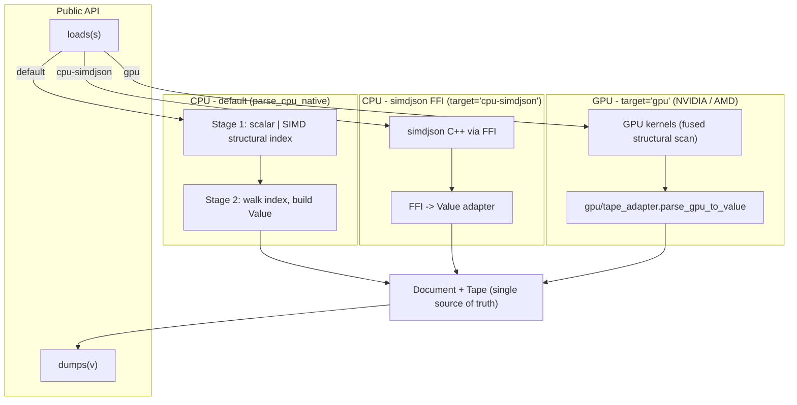
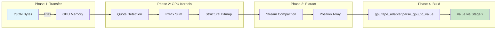

# Architecture

In v0.2 the library is built around a single in-memory representation:
a tape-backed `Document` plus a lightweight `Value` view. Every CPU and
GPU pipeline funnels into the same shape, so the rest of the library
(LazyValue, JSONPath, JSON Patch, schema validation, reflection serde)
operates on one model.

## System Overview



Apple Silicon `target='gpu'` raises by default (Metal backend lacks
raw-pointer kernels in the current Mojo nightly). Recompile with
`-D JSON_GPU_ALLOW_APPLE_FALLBACK=1` to opt into the legacy silent CPU
fallback.

## CPU Backends

### Pure Mojo Backend (Default) -- v0.2 two-pass parser

**Implementation:** Stage 1 builds a structural index of every byte
offset whose character is `{ } [ ] : , "` (outside string literals).
Stage 2 walks that index to produce a `Value` tree without re-scanning
bytes for structure.

**Location:**
- `json/cpu/stage1_scalar.mojo` -- byte-by-byte oracle (canonical;
  used for correctness validation of the SIMD path).
- `json/cpu/stage1.mojo` -- 32-byte SIMD scan via
  `memory.unsafe.pack_bits`.
- `json/cpu/stage2.mojo` -- index walker; emits `Value`. Strict
  validation for trailing commas, double commas, leading zeros,
  missing colons, missing values, unquoted keys, invalid escapes,
  and trailing top-level content.
- `json/cpu/__init__.parse_cpu_native[force_scalar=False|True]` --
  the public CPU entry point. Default is SIMD (1.5x to 2.2x faster
  than the scalar walker on the benchmark corpora); pass
  `force_scalar=True` for differential testing.
- `tests/test_stage1_equivalence.mojo` -- asserts stage 1 SIMD and
  scalar produce byte-identical position lists, including a
  full-document run against the benchmark corpora.

**Performance (Apple Silicon, M-series; `pixi run -e dev bench-cpu`):**

The bench reports both `parse + peek` and `parse + traverse-every-value`.
The peek workload is what the lazy `Value` was optimised for; the
traverse workload is what nearly all real consumers actually do.

| Corpus | Size | simd peek | tape peek | simd traverse | tape traverse | simdjson C++ |
|---|---|---|---|---|---|---|
| `twitter.json` | 617 KB | **1.18 GB/s** | 0.23 GB/s | 142.9 ms | **4.17 ms** | 2.66 GB/s |
| `citm_catalog.json` | 1.7 MB | **1.33 GB/s** | 0.23 GB/s | **701 ms ❌** | **11.38 ms ✅** | 3.13 GB/s |
| `twitter_large_record.json` | 804 MB | **0.73 GB/s** | 0.15 GB/s | n/a | n/a | 1.47 GB/s |

The `citm_catalog` traverse row is the punchline:
`simd_traverse` raises `Key not found` mid-walk because the lazy
`object_items()` re-scans the raw substring for each remembered key,
and that second scan can disagree with the first on documents with
duplicate keys or non-trivial escapes. The tape path doesn't have
this problem because every value is a stable tape index. Tape is
30-60x faster than the lazy walk *and* the only path that walks
`citm_catalog` correctly.

The peek-only rows still measure something useful -- pure
parse-validate cost with no DOM consumption -- but the traversal rows
are the honest CPU comparison.

**Usage:**
```mojo
from json import loads
var data = loads('{"key": "value"}')  # default
```

### simdjson FFI Backend

**Implementation:** FFI wrapper around [simdjson](https://github.com/simdjson/simdjson)

**Location:**
- `json/cpu/simdjson_ffi/` -- C++ wrapper
- `json/cpu/simdjson_ffi.mojo` -- Mojo FFI bindings

**Performance:** ~0.48 GB/s on `twitter.json` -- the FFI marshalling is
the bottleneck here; if you want the simdjson algorithm without the
FFI tax, use the default Mojo simd path instead.

**Usage:**
```mojo
from json import loads
var data = loads[target="cpu-simdjson"]('{"key": "value"}')
```

### CPU Parsing Flow (simdjson)

1. Load JSON string into memory.
2. Call simdjson via FFI (`json/cpu/simdjson_ffi.mojo`).
3. Recursively build `Value` tree from the simdjson result.
4. Return parsed `Value`.

### CPU Parsing Flow (default, two-pass)

1. **Stage 1:** scan bytes once, emitting offsets of structural
   characters outside strings.
2. **Stage 2:** walk the structural index in O(structural_count),
   recursively constructing `Value` for objects, arrays, strings,
   numbers, and primitives. No byte-level re-scan.
3. Return parsed `Value`.

## GPU Backend

**Implementation:** Native Mojo GPU kernels inspired by [cuJSON](https://github.com/AutomataLab/cuJSON)

**Location:**
- `json/gpu/parser.mojo` - Main GPU parser (`parse_json_gpu`, `parse_json_gpu_from_pinned`)
- `json/gpu/kernels.mojo` - CUDA-style GPU kernels (fused bitmap + structural extraction)
- `json/gpu/stream_compact.mojo` - GPU stream compaction for position extraction
- `json/gpu/bracket_match.mojo` - GPU parallel bracket matching (experimental; the main parse path uses a CPU stack matcher after stream compaction)

**Performance:** ~8 GB/s on NVIDIA B200 (1.8x faster than cuJSON)

**Techniques:**
- Bitmap-based parsing
- Parallel prefix sums
- GPU stream compaction for position extraction
- Hybrid GPU/CPU pipeline

### GPU Pipeline



### GPU Parsing Flow

1. **Host-to-Device Transfer:** Copy JSON bytes to GPU using pinned memory (HostBuffer) for fast transfer (~15ms for 804MB)
2. **GPU Kernels:** Execute parallel kernels to:
   - Create bitmaps for quotes, escapes, structural characters
   - Compute parallel prefix sums to identify in-string regions
   - Extract structural character bitmap
3. **Stream Compaction (GPU):** Extract only the positions of structural characters (~50ms)
4. **Device-to-Host Transfer:** Copy compact position array back to CPU
5. **Tape Adapter (CPU):** `gpu/tape_adapter.parse_gpu_to_value` merges the GPU `{ } [ ] : ,` positions with a small CPU quote-only scan to produce a stage1-compatible `StructuralIndex`, then runs **stage 2** to construct the `Value`. The v0.1 byte-level re-scan in `_build_array` / `_build_object` is gone.
6. **Value Tree Construction (CPU):** Build `Value` tree from structural info

### Why Hybrid GPU/CPU?

- **GPU excels at:** Parallel bitmap operations, prefix sums, stream compaction
- **CPU excels at:** Sequential bracket matching, tree construction with dynamic memory
- **Key insight:** GPU stream compaction dramatically reduces D2H transfer size (from 465MB to <10MB for 804MB input)

## Value Type

The `Value` struct represents any JSON value (null, bool, int, float, string, array, object).

See [API Reference](https://ehsanmok.github.io/json/) for complete `Value` methods.

## Directory Structure

```
json/
├── __init__.mojo              # Public API exports
├── parser.mojo                # Unified CPU/GPU parser, loads/load functions
├── serialize.mojo             # dumps/dump functions
├── value.mojo                 # Value type definition
├── types.mojo                 # JSONInput, JSONResult types
├── iterator.mojo              # JSONIterator for traversing results
├── ndjson.mojo                # NDJSON parsing/serialization
├── lazy.mojo                  # On-demand lazy parsing
├── streaming.mojo             # Streaming parser for large files
├── config.mojo                # Parser/Serializer configuration
├── errors.mojo                # Error formatting with line/column
├── unicode.mojo               # Unicode escape handling
├── patch.mojo                 # JSON Patch & Merge Patch (RFC 6902/7396)
├── jsonpath.mojo              # JSONPath query language
├── schema.mojo                # JSON Schema validation
├── reflection.mojo            # Compile-time reflection serde
├── deserialize.mojo           # serialize_json / deserialize_json API
├── cpu/
│   ├── __init__.mojo         # CPU backend exports
│   ├── types.mojo            # Common JSON type constants
│   ├── mojo_backend.mojo     # Pure Mojo JSON parser
│   ├── simd_backend.mojo     # SIMD-accelerated CPU parser
│   ├── simdjson_ffi.mojo     # simdjson FFI bindings
│   └── simdjson_ffi/         # C++ simdjson wrapper (libsimdjson via conda)
└── gpu/
    ├── parser.mojo            # GPU parser implementation
    ├── kernels.mojo           # GPU kernel functions
    ├── stream_compact.mojo    # GPU stream compaction
    └── bracket_match.mojo     # GPU parallel bracket-match (experimental)

tests/
├── test_api.mojo              # Unified API tests (loads/dumps/load/dump)
├── test_value.mojo            # Value type tests
├── test_parser.mojo           # Parser tests (simdjson backend)
├── test_mojo_backend.mojo     # Pure Mojo backend tests
├── test_serialize.mojo        # Serialization tests
├── test_serde.mojo            # Struct serialization tests
├── test_reflection.mojo       # Reflection-based serde tests
├── test_patch.mojo            # JSON Patch tests
├── test_jsonpath.mojo         # JSONPath tests
├── test_schema.mojo           # JSON Schema tests
├── test_e2e.mojo              # End-to-end tests
├── test_gpu.mojo              # GPU parser tests
├── test_gpu_kernels.mojo      # GPU kernel tests (stream compaction)
├── test_bracket_match.mojo    # GPU bracket-match tests
└── bench_bracket_match.mojo   # GPU bracket-match microbenchmark

benchmark/
├── datasets/                  # Benchmark files
├── mojo/
│   ├── bench_cpu.mojo        # CPU benchmark (simdjson FFI)
│   ├── bench_backend.mojo    # Backend comparison (simdjson vs Mojo)
│   └── bench_gpu.mojo        # GPU benchmark
├── cpp/
│   └── bench_simdjson.cpp    # Native simdjson C++ benchmark
└── cuJSON/                    # Optional cuJSON checkout (cloned manually;
                               # see benchmark/README.md) for head-to-head
```

## Build & Test

```bash
# Build simdjson FFI wrapper
pixi run build

# Run tests
pixi run tests-cpu  # CPU parser tests
pixi run tests-gpu  # GPU parser tests

# Benchmarks
pixi run bench-cpu   # CPU: json vs simdjson
pixi run bench-gpu   # GPU: json only
pixi run bench-gpu-cujson  # GPU: json vs cuJSON
```

## Dependencies

- **Mojo:** Latest nightly (with GPU support), pulled in automatically by `pixi install`
- **simdjson:** Installed from conda-forge (`simdjson >=4.2.4,<5`). The thin
  C++ FFI wrapper in `json/cpu/simdjson_ffi/` is auto-built by `pixi install`
  via the activation hook.
- **sysroot_linux-64:** `>=2.34` (Linux only) so `mojo build` can link
  against glibc 2.34 symbols referenced by Mojo's runtime libs.
- **cuJSON:** Optional; clone manually into `benchmark/cuJSON` for the
  head-to-head GPU benchmark. See `benchmark/README.md`.
- **CUDA:** Required for the GPU backend (any SM70+ NVIDIA GPU works;
  the library has also been tested on AMD ROCm and Apple Silicon).
